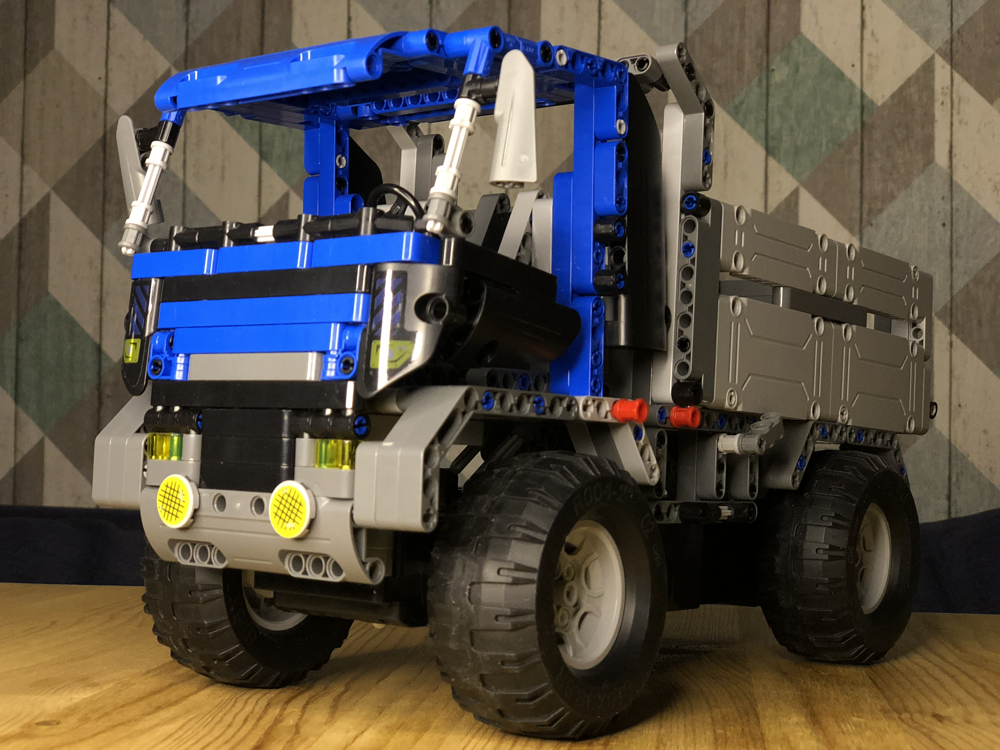

# kotyambaCar
Your own self-driving car

Table of Contents
=================
* [control_motors](#control_motors)
* [RPi_access_point](#RPi_access_point)

## control_motors
1. simple_motor.py
Minimum functionality to test if our wiring of RPi & H-Bridge & car motors works
2. cli_manual_mode.py - try different values of Duty Cycle and active_time_sec to observe vehicle dynamics
Functionality for callibration of movement functions.
3. motor_pwm.py - execute asynchronious commands for motor movement 
4. vehicle.py - represents our car, is driven by steering and direction motors.

## RPi_access_point
Run docker container for network configuration of raspberry pi,
that allows to function RPI as Access Point
### contents
1. /configs - network configuration files
2. Dockerfile - set of commands for docker builder to build image(copies config files and script)
3. scripts/start_RPi_access_point.py - script that is executed in docker container(alpine linux) to setup network
4. services
Contains files to setup execution of docker container to establish Access Point mode for RPi on system startup 
start_RPi_Docker_Container.service - file for systemd, service desciption file, starts docker
start_RPi_Docker_Container.sh.sh - is executed by start_RPi_Docker_Container.service
stop_RPi_Docker_Container.sh - stop docker container
5. preparePi.sh - script that should be executed manually(only once) to prepare pi to work in Access Point  mode
after that everything will be done automatically
6. unPreparePi.sh
undo effects of preparePi.sh and return RPi back to the station mode (can connect to WiFi)